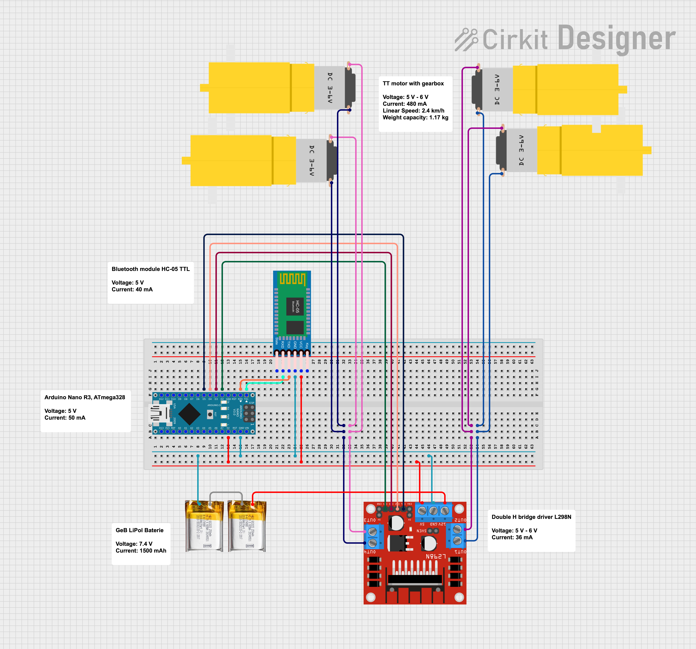

# Arduino Car

> Bluetooth connecthion, moving in four directhions

## Circuit

## Result

## Motors controling

Two motors to pin 2,3 parallel
Two motors to pins 4,5 parallel

0 0		- off
0 1		- backward
1 0		- forward
1 1		- stop moving